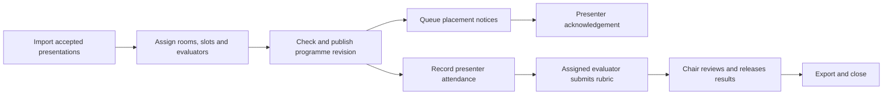
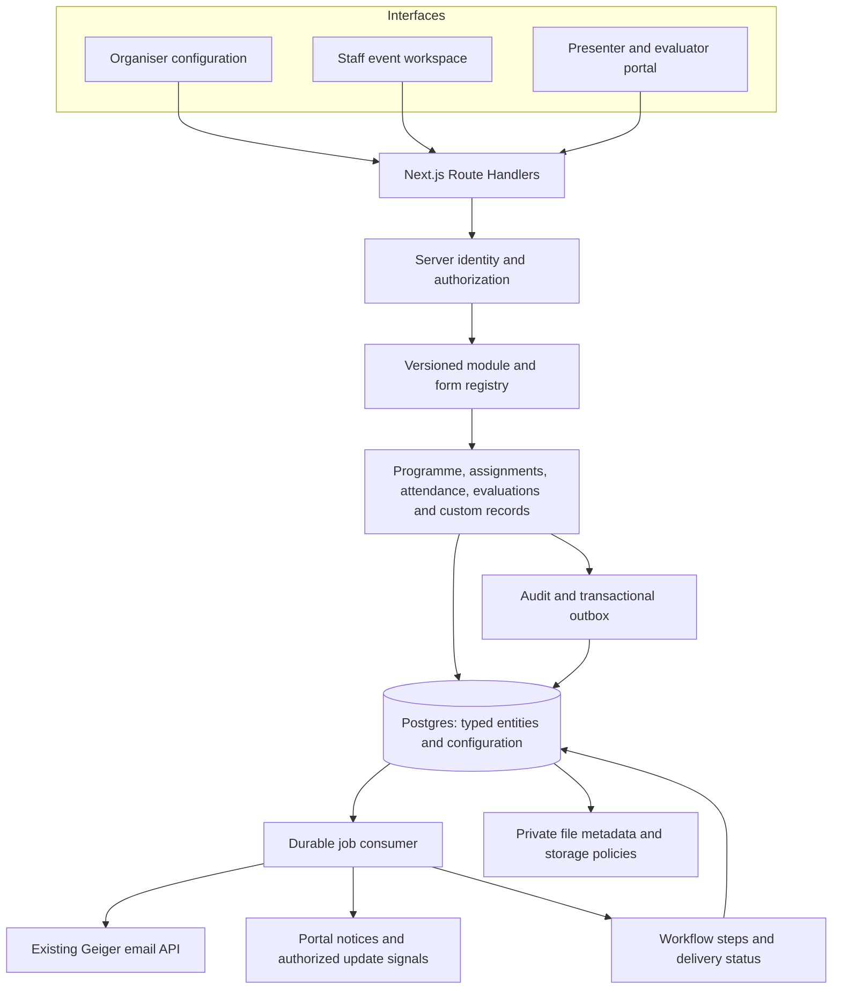

# Event Workspace: configurable organiser operations

Date: 30 September 2026

Status: **Architecture direction accepted on 30 September 2026; broad applicability required; execution plan review pending**

Product: Geiger Events
Research: [Comparable products and sources](../../research/2026-09-30-event-operations-products.md)

## 1. Intended outcome

An organiser can enable an optional operational workspace for an event, select modules, adapt forms and views, assign roles, and run that event with staff and external collaborators. The same platform must support many activities across many event types.

The user's concrete example is a research conference: staff place presenters in rooms, communicate the placement, and reviewers record presenter attendance, evaluation, and remarks. This must work after the event starts, including changes to placements. It is the acceptance scenario for the first release, rather than a requirement to turn every event into a conference.

Call the feature **Event Workspace**, with **Operations** as its entry point. CRM remains the existing contacts and relationship module within the wider product.

Working assumptions for this draft:

- Integrate into this repository and its current project/event model.
- Keep the existing event page, ticketing, contacts, and attendee experience available without Operations.
- Start with organiser staff plus restricted presenter/evaluator portal access. These people need not buy a ticket or become organisation members.
- Initial scheduling is manual, with conflict detection. Automated optimization is later work.
- First release imports already accepted presentations. Full call-for-papers and pre-event peer review are a later pack expansion.
- Event workspace creation means assembling/configuring an application hosted by Geiger. It does not provision a new database, deployment, or executable backend for every organiser.

Success means organisers can assemble workspaces for substantially different event types using the same module contracts, with accountable changes and restricted access. The conference is one reference workflow. A workshop and a competition must also exercise the foundation before it is considered ready; no core service may require a paper, presenter, conference track, or conference session to function.

## 2. Research-led choice

The product research found relevant workflow patterns in [Cvent](https://www.cvent.com/en/event-marketing-management/abstract-management-software), [EventsAir](https://www.eventsair.com/event-management-software/abstract-management-software), [Oxford Abstracts](https://oxfordabstracts.com/product/abstract-management-software/), [Ex Ordo](https://support.exordo.com/article/523-conference-workflow), [Fourwaves](https://fourwaves.com/abstract-management-software/), and [Sessionize](https://sessionize.com/playbook/evaluations/evaluations-start-to-finish). [Airtable](https://www.airtable.com/platform/interface-designer) and [Zoho Creator](https://www.zoho.com/creator/automate-workflow.html) provide useful models for configurable interfaces and automation.

Choose a **hybrid of native event modules and controlled configuration**. Core relationships and operational rules use typed data and domain services. Organisers configure labels, fields, forms, permitted workflow transitions, views, dashboards, and approved automation actions. Bounded custom record modules are a first-class foundation capability, rather than a conference-specific feature added after the pilot.

A fully general no-code builder would also require arbitrary schema creation, relation semantics, expressions, authorization, and reporting. That substantially increases the implementation before solving the original event workflow. External builder integrations can help validate workflows, but should not become Geiger's primary source of event data.

## 3. Current repository: reuse and gaps

These findings are based on local source and migration files. They are not a verification of deployed database state or production behaviour.

| Foundation | Local evidence | Architectural consequence |
| --- | --- | --- |
| Project and event ownership | `context/project-context.js`, `events.events`, `public.projects` | Reuse project as the tenant boundary and event as the operational boundary |
| Contact book | `supabase/migrations/20260715100711_contacts.sql` | Link event participants to existing contacts; do not build a second CRM |
| Conference record managers | `lib/supabase/conference.js`, `lib/supabase/records.js`, `components/internal/screens/conference/modules/` | Reuse UI patterns and legacy adapters; core operations need stronger relations than generic config bags |
| Existing agenda | `components/internal/screens/conference/agenda_builder.jsx`, `lib/agenda/sessions.js` | Existing event association is in `config.eventId`; room/speaker conflicts compare text. Promote operational IDs and timestamps while preserving existing agenda consumers |
| Paper record editor | `modules/paper.jsx` | One score and notes field cannot represent multiple assigned evaluators, rounds, rubrics, or immutable results |
| Speaker attachments | `components/internal/screens/events/event_conference.jsx` | Existing `speakerIds` metadata attaches reusable records; it is not an event-specific presenter assignment |
| Workflow definitions/history | `lib/supabase/workflows.js`, `workflow_runs.js`, corresponding migrations | Persisted definitions exist; local source explicitly states there is no execution runner |
| Campaign editor | `lib/supabase/campaigns.js`, `campaign_editor.jsx` | Local source explicitly says no dispatch; advancing status is not evidence of email delivery |
| Transactional email client | `lib/email/client.js`, `lib/email/notifications.js` | Reuse Geiger's email API behind a durable delivery adapter; verify idempotency, templates, status callbacks, and quotas before rollout |
| Add-on platform | `addons/manifest_schema.js`, `addons/registry.js`, `events.project_addons` | Reuse compiled code registration and project availability; add separate event module configuration and dependency validation |
| Shared RBAC | `geiger-rbac.config.js`, `events.role_grants`, `events.rbac_allows` | Reuse staff role vocabulary; add action-level checks and assignment-bound resource restrictions |
| Portal identity | `lib/portal/session.js`, `20260726194118_portal_members.sql` | Portal members have custom sessions and are distinct from Supabase Auth users; an explicit identity adapter is necessary |
| Forms | `lib/forms/fields.js`, shared form editor/input components | Reuse UI; add server validation, stable IDs, schema versions, and evaluation-specific scoring |
| Attendance | `events.checkin_attendance` | Reuse entry/session attendance evidence, but separately record whether a specific presenter delivered a specific presentation |

One access prerequisite needs suite coordination: the RBAC migration documents an intentionally broad write policy for shared `public.roles`, with role editing gated in the UI. Existing conference table policies are project-membership based. Neither is sufficient as proof of least-privilege operational access. Verify deployed policies and resolve relevant role-definition writes before exposing restricted operational roles. This does not authorize a broad suite refactor in this design.

## 4. Product model: core, modules, and event packs

**Core platform services** manage tenancy, identities, access, module configuration, forms, assignments, files, audit history, notifications, automation execution, and exports.

**Native modules** supply a useful interface plus domain rules. They have stable IDs and declared dependencies. Their labels can change without changing permission keys, storage identifiers, or workflow event names.

**Event packs** are versioned starting configurations: module selections, fields, forms, role suggestions, views, and workflow recipes. Installing a pack copies configuration into an event; later template edits do not silently change a running event.

**Custom modules** use the same records, forms, assignment, access, lifecycle, and reporting contracts as native modules. An organiser can create a volunteer onboarding module, vendor inspection module, artist preparation module, or another event-specific record collection without deploying code. Complex domain rules still require a native capability; configurable storage is not a promise of arbitrary application execution.

| Module | Typical records/actions | Reuse across event types |
| --- | --- | --- |
| People | Participants, event roles, contact links, availability | Presenters, judges, volunteers, exhibitors, trainers |
| Resources | Physical rooms, stages, booths, equipment, constraints | Conferences, festivals, exhibitions, workshops |
| Programme | Sessions, activities, presentation slots, assignments, publication | Talks, performances, classes, competition rounds |
| Tasks | Owner, due date, checklist, dependencies, completion | Setup, speaker preparation, volunteer duties |
| Custom records | Organiser-defined scalar fields, constrained references, statuses, forms, and views | Vendor readiness, transport requests, rehearsals, equipment inspections, volunteer onboarding |
| Forms | Intake, confirmation, attendance, inspection, evaluation | Different questions over common form/version infrastructure |
| Attendance | Entry evidence, session presence, presenter attendance, corrections | Participation, completion, no-shows |
| Evaluation | Rubrics, assigned evaluators, scores, private remarks, result release | Research talks, competitions, awards, training |
| Communications | Templates, targeted recipients, placement messages, reminders | Every event pack |
| Operations overview | Missing people, conflicts, outstanding evaluations, delivery failures | Every event pack |
| Reports | Permission-scoped roster, schedule, attendance, scores, audit export | Every event pack |

Initial reference packs: **Research Conference Operations**, **Workshop/Training Operations**, and **Competition Operations**. Each uses the same activity, assignment, form, attendance, and evaluation services. Exhibition and festival packs follow using these contracts; they must not require a fork of the core.

## 5. Organiser and staff experience

An event's Operations entry offers **Set up workspace**. The organiser chooses a pack, toggles available modules, names their roles, creates forms/rubrics, previews role interfaces, and publishes the configuration. Project-level add-on availability or commercial entitlement does not automatically enable a module for every event.

The event workspace has a persistent event selector and status, a module sidebar, a role-aware home screen, and focused record pages using existing `@geiger/ui` components. Simple events only show their enabled modules. Project-wide conference/CRM lists remain useful as libraries and cross-event views.

The first conference screens are:

1. **Overview:** unassigned presentations, schedule conflicts, unconfirmed presenters, absent presenters, incomplete evaluations, and failed notifications. Each number opens a filtered actionable list.
2. **People:** presenter/evaluator/room-staff rosters and pending invitations.
3. **Rooms and Programme:** room availability, session timetable, presentation slots, presenter assignments, and a publish/change preview.
4. **Attendance:** a room staff roster with one-tap present/absent/excused actions and correction history.
5. **Evaluations:** assigned presentations, rubric progress, drafts, submission, chair review, and controlled release.
6. **Communications and Reports:** recipient preview, delivery state, schedule notices, roster/attendance/evaluation exports.
7. **Workspace Setup:** modules, forms, roles, views, workflow recipes, and configuration versions.

An evaluator's mobile interface starts at **My assignments**. A presenter sees **My presentations**, room/time, acknowledgement, and any explicitly released feedback. Room staff see **My room** and presenter attendance. An organiser can preview these views, but previewing does not create or impersonate a user's session.

Data-entry failures keep the user's draft and show a retry action. Submission failure never displays success. Empty states distinguish no assignments from no permission. Offline/unavailable networking has a visible status; the first release does not claim offline synchronization.

## 6. Conference acceptance scenario

Example: 120 accepted papers, 150 presenters, 6 physical rooms, 24 sessions, and 18 evaluators. These are planning examples, not scale limits.

1. Import accepted papers/presentations and link their authors and actual presenters. One paper may have multiple authors; a submitter is not automatically a presenter. A presentation can have more than one scheduled presenter.
2. Create physical rooms, tracks, and sessions. Allocate each presentation to a slot within a session, including duration and buffer. The room belongs to the session; the presentation inherits its current placement.
3. Assign presenters and evaluators; optionally assign a room chair. Availability, room capacity/equipment, overlapping commitments, evaluator workloads, and declared conflicts are checked.
4. Preview and publish a programme revision. Only published placements notify presenters. Queue one personalized message per affected recipient, with event-local date/time and an authenticated link to current placement.
5. Presenters acknowledge the current revision. Acknowledgement of an older placement does not confirm a later room/time change.
6. On the day, permitted room staff or evaluators record attendance **for each presenter on each presentation**. Event entry scans can be supporting evidence; they do not prove someone presented.
7. Assigned evaluators complete a versioned rubric and remarks, saving drafts and submitting independently. They cannot see other evaluators' scores by default. A room-wide assignment may authorize attendance but does not automatically authorize grading every talk.
8. A chair sees completion and aggregates submitted scores. Missing or absent evaluations are not treated as zero. A documented decision resolves incomplete work; final results/remarks remain private until explicitly released.
9. Close the activity/event and export a reproducible report containing placement revision, attendance corrections, rubric version, submitted evaluation revisions, aggregation policy, and release state.

Paper review before acceptance uses a different cycle from live presentation evaluation. Its target is a submission/version; live evaluation targets a delivered presentation. Audience feedback is a third process. They can share form infrastructure, but not authorization or outcomes.

## 7. Technical architecture

Keep a **modular monolith** in the existing Next.js application, backed by Supabase/Postgres, plus a separately invoked durable job consumer. Domain boundaries are code boundaries initially, rather than separate microservices.

All new operations access goes through one server-only data access layer. UI clients do not directly mutate operational tables. A command resolves identity, authorizes the exact action/resource, validates its pinned configuration, performs its database transaction, and returns a minimal response. Role interfaces get different response projections; hiding fields in JSX is insufficient.

Supabase Auth staff and custom-session portal members adapt to a common server-derived principal. The identity providers remain separate for this release. Do not place a portal member ID into `auth.uid()` semantics or authorize using a caller-supplied email.

Use database transactions for the mutation, audit record, and outbox event. Use constrained database routines or a private server database connection for multi-statement transactions; independent Supabase HTTP writes do not become atomic merely because they are awaited together. Client-callable privileged routines must not accept arbitrary actor identity. If a service-role path is used, its authorization is performed in the shared server layer because that key bypasses RLS.

Suggested boundaries:

| Unit | Responsibility | Dependencies |
| --- | --- | --- |
| `lib/operations/identity` and `access` | Verified principal, staff grants, participant links, resource access | Existing auth/portal session and RBAC |
| `lib/operations/config` | Validated module dependencies, versioned workspace/forms/views | Compiled module registry and configuration store |
| `lib/operations/activities` and `programme` | Generic activities, optional schedules, allocation, conflicts, release snapshots | People, physical resources, transactions |
| `lib/operations/assignments` | Explicit responsibility, confirmation, revocation, scopes | Identity and typed resource links |
| `lib/operations/attendance` | Presenter/activity attendance and corrections | Programme, people, existing check-in evidence |
| `lib/operations/evaluations` | Rubrics, evaluation cycles, drafts, submissions, result release | Forms, assignments, private data |
| `lib/operations/messaging` | Recipient snapshots, templates, delivery states | Outbox and Geiger email adapter |
| `lib/operations/automation` | Trigger dispatch, persisted steps, delays, retries | Existing workflow editor plus durable execution |
| `lib/operations/records` and `references` | Native/custom entities and validated relations through one contract | Versioned module definitions and common access |

Candidate UI folders: `components/internal/screens/operations/` and `components/portal/operations/`. Candidate staff API prefix: `/api/operations/events/[eventId]/`; portal prefix: `/api/portal/operations/events/[eventId]/`. Both call the same domain services. Route shape is a proposal; final integration must follow the existing workspace routing conventions.

## 8. Data architecture

Use typed relational tables for fields required by permissions, joins, conflicts, uniqueness, and reporting. Use JSONB for validated configuration/custom scalar answers. Never make the only link to a presenter, room, evaluator, or event a free-text label or an unchecked UUID inside JSON.

The table families below describe the target architecture. They are not a migration to create in one batch. Each subproject introduces only the tables it needs.

| Proposed table family in `events` | Purpose and important links |
| --- | --- |
| `ops_workspaces`, `ops_workspace_versions`, `ops_module_instances` | One workspace per event; draft/published configuration; pinned module/config versions and dependencies |
| `ops_entities` | Authoritative event-scoped resource identity shared by native and custom records; stable entity ID, module ID, definition version, title, lifecycle state, and revision |
| `ops_participants`, `ops_participant_roles`, `ops_identity_links` | One event-local person linked to an existing contact; multiple functional roles; verified staff/portal identity links |
| `ops_invitations` | Hashed, expiring, single-use invite capability; expected role/scope; acceptance and revocation |
| `ops_rooms`, `ops_resource_availability` | Physical resources linked to existing venues where available; capacities, equipment, event-local availability |
| `ops_activities`, `ops_activity_people`, `ops_resource_reservations` | Optional typed schedules and parent activity; person participation and presenter/author relationships; real resource reservations. A conference session and its talks are configured activity types, alongside classes, performances, inspection rounds, and judging rounds |
| `ops_assignments` | Responsibility rows with explicit typed targets and participant/actor links; status, dates, and revocation |
| `ops_programme_releases`, `ops_programme_release_items`, `ops_acknowledgements` | Immutable published snapshots and confirmation of a particular placement revision |
| `ops_forms`, `ops_form_versions`, `ops_form_responses` | Versioned forms and answers with stable field IDs; historical labels/types retained |
| `ops_attendance`, `ops_attendance_changes` | One current mark per participant/activity and attendance purpose, with append-only corrections, actor, method, and optional check-in evidence |
| `ops_evaluation_cycles`, `ops_evaluations`, `ops_evaluation_revisions` | Any approved event entity target and rubric version; one evaluation per assignment/cycle; immutable submitted revisions and controlled reopen |
| `ops_tasks` | Event tasks, explicit owners/targets, due dates, and completion history |
| `ops_outbox`, `ops_messages`, `ops_message_attempts`, `ops_audit` | Durable business events, deliveries, retries, and changes; no browser writes |
| Existing workflows/runs plus version/step tables | Immutable workflow definitions at run start; durable step executions, leases, resume times, and deduplication |
| `ops_custom_module_versions`, `ops_custom_records`, `ops_entity_links` | Bounded user-defined record modules and validated relations to registered event entities; never one physical table per organiser |

Common invariants:

- Operational rows have non-null `project_id` and `event_id`. Unique parent keys and composite foreign keys ensure a child cannot point into another event/project.
- `ops_participants` is unique on active `(event_id, contact_id)` when a contact exists. A participant may have both staff and portal identity links, but each link has exactly one identity type and uses verified IDs. Shared email is not sufficient to merge identities.
- Core entity IDs and authorization target types are stable. Assignments, relations, forms, and evaluation targets use composite foreign keys to `ops_entities`, with a definition-level target capability check. Native subtype rows reference the same entity identity and enforce their module/type using a composite key. Registration/subtype changes occur in one transaction. The registry owns identity; subtype/custom stores own their domain data. Unchecked polymorphic `target_type/target_id` pairs are not an acceptable shortcut.
- A session has `starts_at < ends_at` and an IANA event timezone. Presentation slots fit inside a session. Concurrent presentations are separate slots/sessions according to the pack; poster walks may deliberately allow parallel evaluator targets.
- Sessions reserve rooms; presentations inside a session do not each reserve the whole room independently. Presenters/evaluators reserve their actual commitment intervals.
- All draft edits/publications serialize through an event-level transaction lock at pilot scale. Publication validates the full proposed timetable and atomically writes a release. Concurrent publish attempts use an expected revision and one receives a conflict response. Database exclusion constraints can replace/cooperate with this scheme later after checking deployed extension versions.
- An active grading assignment is unique per `(cycle, presentation, evaluator)`. Submitted evaluation revisions are immutable; changing a rubric after scoring starts creates a new cycle/version and does not recalculate historical scores silently.
- Mutable records use a numeric revision for optimistic concurrency. An outdated update returns a conflict instead of overwriting another staff member's work.
- Indexes start with tenant/event filters, then assignment/status/time fields used by actual queries. Use paginated lists and permission-scoped exports; add custom-field indexes only for measured filter workloads.

New operational tables revoke default `anon`/`authenticated` grants and enable RLS with no direct client policies initially, following the server-access model already used by portal identity tables. Do not rely on the existing schema's broad default privileges. Private jobs/files/results are not published through legacy public conference-record policies. If later client reads or realtime subscriptions are added, they require narrowly scoped policies and projections with explicit tests.

File uploads use a private bucket with event/resource metadata and short-lived authorized access. Abstracts, evaluator remarks, slides, and unpublished schedules must not inherit the public `products` bucket behaviour. Files intended for an anonymous academic review need an organiser-controlled anonymized version; hiding author fields does not remove identifying content from a document.

## 9. Configuration contract and builder limits

A compiled native module definition declares: stable ID/version, dependencies, entity adapters, field types, supported views, action permissions, lifecycle transitions, and approved trigger/action definitions. Existing add-on manifests remain code registration; they must not be confused with untrusted event configuration.

The capability contract is shared by native and custom modules: `records`, `forms`, `assignments`, `scheduling`, `resourceReservation`, `attendance`, `evaluation`, `tasks`, `notifications`, and `reporting`. A module opts into capabilities it needs. A task or vendor-readiness module does not need a schedule; an inspection can use evaluation without being a presentation. Dependency validation resolves capabilities, not event genre names.

The configuration lifecycle is **draft → validate → role preview → publish → archive**. An event pins published workspace configuration. A module cannot be disabled while a dependent module is enabled; disabling archives access rather than deleting records or history. Revocation overrides old published configuration immediately.

First-release configuration supports:

- Enabling available modules and selecting a pack.
- Creating a bounded custom record module with a stable key, typed scalar fields, validated event-entity references, statuses, safe forms/views, and approved capability options.
- Adding scalar custom fields, conditional questions, rubric criteria, required fields, and validated ranges/options.
- Choosing table/board/calendar views supported by each module, columns, safe filters, and role-specific landing pages.
- Configuring roles from approved action capabilities and event scope; no arbitrary SQL permission predicates.
- Using approved workflow recipes: placement published → notify; evaluation due → remind; presenter absent → create a task.

Later configuration expands attachment workflows, richer layouts, advanced formulas, and integration adapters. The query/expression compiler allowlists operators, parameterizes values, rejects cycles/unknown fields, and never evaluates organiser-provided JavaScript or SQL. Core fields cannot be deleted or have their type changed by configuration.

Forms and custom definitions retain their historical versions. Destructive schema changes create a new version and require a deliberate migration of active records; completed responses keep the version they were submitted against.

## 10. Permission design

Access is the intersection of **tenant/event access + action capability + resource assignment/ownership + field projection + lifecycle rules**. UI navigation permissions alone do not grant read/write access. Assignment restrictions narrow an event role; they do not create access to unrelated events.

| Role | Default operational scope |
| --- | --- |
| Event owner/operations manager | Configure workspace, manage programme/people, publish, assign, close, and export permitted data |
| Programme chair | Manage specified programme/review cycles, inspect submitted results, release approved feedback |
| Room chair/staff | Read assigned room schedule; mark/correct presenter attendance for that room; no unrelated private evaluations |
| Evaluator | Read assigned presentations and rubric; edit own drafts; submit own evaluation; attendance only if separately granted |
| Presenter | Read own current placements; acknowledge; upload requested materials; see explicitly released feedback |
| Volunteer | Read/complete own assigned tasks and limited relevant records |

Suggested action keys include `events.operations.configure`, `events.programme.assign`, `events.programme.publish`, `events.attendance.mark`, `events.evaluation.submit`, `events.evaluation.results.read`, and `events.evaluation.results.release`. Keep them independent from editable labels.

Staff grants continue to use `@geiger/rbac` with event scope. Assignment-specific narrowing is an additional server predicate; the current engine's missing scope key means unrestricted scope and must not accidentally broaden a room/evaluator grant. External portal collaborators receive explicit operational grants linked to verified portal identity, rather than organisation membership. New portal grants use the same action rules but not staff wildcard privileges.

An invite is an authenticated onboarding mechanism, not a permanent public link granting access to evaluations. Acceptance requires a verified account matching the invitation, is single-use, and cannot elevate beyond the grant created by an authorized organiser. Revoking an assignment/role blocks the next read/write and any unsent jobs that depended on it.

## 11. Evaluations and attendance semantics

For a sample live rubric: content 40%, delivery 30%, originality 20%, timing 10%, each scored 1–5. Compute `100 × sum(weight × (score − 1) / (max − 1)) / sum(weight)` for submitted complete evaluations. Validate weights and ranges on the server. This is an example policy, not a fixed rubric for every event.

The default aggregate is the mean across submitted complete evaluations, with a configured minimum count before release. Missing evaluations are shown as incomplete; excused/absent presentations are excluded from ranking by default and require an explicit chair policy to handle differently. Internal remarks and presenter-visible comments are separate fields. A chair can reopen an evaluation with a reason, creating a new revision; the original submission remains reportable.

Attendance states are unknown, present, absent, and excused. An empty mark stays unknown. Corrections store previous/new states, actor, server time, and reason. Actual presentation completion is distinct from both entering the venue and acknowledging a schedule email. Closing an event makes ordinary operations read-only; explicit reopen/correction commands remain audited.

## 12. Durable communication and automation

Use an outbox written in the same transaction as a business change. The durable consumer dispatches allowlisted workflow actions and sends notices through the existing Geiger email adapter. Supabase's [Postgres-backed queues](https://supabase.com/docs/guides/queues) are a suitable default transport; use scheduled bounded consumers or a dedicated Node worker depending on deployment limits. The transport can change without changing domain commands.

The core contract is **at-least-once processing with idempotent effects**. Deduplicate `(event, business-event ID, workflow version, step ID)` and `(recipient, placement revision, notice kind)`. Persist run state, attempts, next resume time, and leases. Delays are stored due timestamps, not sleeping HTTP requests. Bound fan-out and retries; failed work enters a visible manual retry queue.

Programme publishing captures the changed recipients and relevant placement snapshot. Before dispatch, check current access and whether the placement is superseded. Suppress obsolete pending notices and send the latest effective placement. Emails name their revision and link to the authenticated current placement because a delivered email cannot be recalled. Acknowledgement references the effective placement revision.

Delivery states distinguish queued, provider-accepted, delivered (only with provider evidence), failed, and superseded. An API timeout after provider acceptance is ambiguous: reconcile using provider idempotency/status if supported; otherwise expose uncertainty rather than promise exactly-once sending. The local email client currently does not establish that contract, so verifying or extending the suite API is a rollout dependency.

Existing workflow graphs can remain the visual editor. A published workflow pins a validated executable definition; graph coordinates are presentation only. Runs retain the workflow version, actor/service scope, trigger payload, and step outcomes. Pausing prevents new runs; cancelling pending work is a separate action. Replaying jobs rechecks module enablement and current authorization and never silently repeats irreversible effects.

Operational notices use a separate purpose/policy from marketing campaigns. Respect blocked/bounced recipients and explicit operational preferences; do not treat marketing-consent fields as the entire policy for necessary placement communication. Portal notices provide a fallback when email is unavailable.

## 13. Rollout into the existing app

1. Ship behind an event-level feature flag. Existing events keep their current behaviour.
2. Introduce new tables/services and adapters. Keep existing contacts as the person library; link new event participants instead of cloning them.
3. Import legacy paper/session/speaker records through a dry-run mapping. Preserve source IDs and report ambiguous names, missing event links, invalid dates, and duplicate people. Do not guess a presenter from a text name silently.
4. Cut over one opted-in event at a time. After cutover, the new operations tables are that event's authoritative programme. Existing public agenda/display consumers read an adapter over published releases; legacy schedule writes for that event are redirected or disabled.
5. Use one source of truth per event. Avoid permanent dual writes to JSON metadata and typed tables. Rollback before live operations can switch back to untouched legacy data; after attendance/evaluations exist, rollback must preserve/export new operational records and cannot just flip the flag.
6. Keep streaming/breakout room entitlement separate from physical room reservation. Connect them only through explicit links when needed. Existing sponsorship work is adjacent, rather than part of this subsystem's required refactor.

No database changes, product code, dependencies, or deployment are made by this design deliverable. Existing staged work was present before the research and is outside this draft.

## 14. Phased delivery roadmap

Each phase is a separate subproject with a focused spec, implementation plan, and verification. The rough effort ranges are planning estimates, not researched benchmarks or delivery promises. They assume engineers familiar with this repository and time for integration/testing, with design/organiser feedback available.

| Phase | Deliverable and exit condition | Rough engineering effort |
| --- | --- | --- |
| A. Foundation and access | Event workspace/config versions, module/capability contracts, bounded custom definitions and records, verified identity mapping, action/resource access, audit, gated shell. Cross-event and restricted-role denial tests pass. Resolve relevant shared role-write prerequisite. | 4–6 engineer-weeks |
| B. Activities and allocation | Generic activities, participants, resource reservations, assignments, conflict checks, immutable release, and conference import adapters. Conference, workshop, and competition packs use the same services. | 4–6 engineer-weeks |
| C. Day-of-event workflow | Participant/evaluator interfaces, generic attendance/corrections, rubric drafts/submissions, aggregation/release, and permission-scoped reports. Multiple evaluators can safely work on one activity. | 3–5 engineer-weeks |
| D. Durable notices and pilot | Outbox/consumer, placement emails, acknowledgements, failure/retry visibility, three bounded workflow recipes, operational pilot and fixes. Complete original scenario works end-to-end. | 3–5 engineer-weeks |
| E. Advanced configuration | Richer layouts/formulas, reusable organisation templates, file workflows, and assisted safe configuration migration beyond the foundation's basic custom records. | 5–8 engineer-weeks |
| F. Domain expansion | Full submission/peer-review cycles, competition/exhibition packs, integrations, certificates, advanced allocation, and optional offline work, prioritized from pilots | Separate estimates after validated scope |

Initial operational MVP with bounded custom modules: approximately **14–22 engineer-weeks**, excluding unrestricted application execution and full academic peer review. With two engineers plus part-time design/QA, a provisional **10–14 calendar-week** planning range may be reasonable, but access dependencies, suite email work, and pilot feedback can extend it. Re-estimate after Phase A and one complete assignment-to-evaluation slice. Do not extrapolate a date for the full platform from this range.

Build bounded workflow recipes before adding a general execution surface to every existing automation type. Phases A–D deliver the configurable operational MVP and solve the user's first scenario. Phase E broadens existing self-service configuration; Phase F is a set of optional products, not a single giant release.

## 15. Verification and operational readiness

Required checks for the first release:

- Staff/portal identity mapping; cross-tenant/event denial; unassigned evaluator denial; role/assignment revocation; private-field exclusion; direct database mutation denial.
- Concurrent schedule edits and publication; multi-presenter overlaps; room capacity/availability; slots within sessions; event timezone and date boundaries.
- Two evaluators submit independently; stale drafts conflict; submitted results are immutable; reopened evaluation history persists; rubric changes preserve old scores.
- Presenter attendance is per person/presentation; correction history survives; a venue scan never automatically marks presentation delivery.
- A worker crash after a committed change resumes; duplicate queue messages do not duplicate internal effects; email timeout ambiguity is handled; superseded room notices are suppressed; missing email configuration is visible.
- Closing/reopening, export permissions, report reproducibility, schema version changes, and event migration reconciliation.
- Browser-to-API-to-database test of the complete conference scenario on mobile and desktop, with separate staff, presenter, and evaluator sessions.

Provisional load target for the pilot: 2,000 participants, 500 presentations, 50 concurrent staff/evaluators, and 5,000 queued notices in an event. Test a representative staging dataset; these are proposed test inputs, not claims about current capacity. Measure p95 command/read latency, error rate, backlog age, and recovery behaviour before setting production SLOs.

Launch readiness includes a rehearsed backup/restore/export procedure, event-day support ownership, job failure alerts, and visibility into outstanding assignments. Logs avoid raw evaluation remarks and unnecessary personal data. Realtime signals are scoped invalidations followed by an authorized fetch; correctness cannot depend on the browser receiving every signal.

## 16. Decisions ready for review

Accepted direction: optional Event Workspace; hybrid native/configurable modules; project/event scope; staff plus restricted portals; imported accepted presentations as one reference flow; separate live evaluation; modular monolith plus durable consumer; typed core and versioned configuration; gradual per-event cutover. The user's subsequent requirement makes broad applicability and bounded custom modules part of the foundation.

The unresolved product choices are the intended first pilot organiser, whether full paper submission is required before that pilot, and whether offline capture is a launch requirement. This draft assumes a live-online pilot with accepted-presentation import. A change to those assumptions expands the first-release scope and needs a revised estimate.

The next implementation subproject is [Phase A1: module and custom-record foundation](../plans/2026-09-30-operations-foundation.md), followed by typed people/resources/activities in A2. Its module contracts must be exercised by conference, workshop, competition, and organiser-defined operational records. Detailed execution requires review of the written implementation plan; no Operations product implementation is claimed in this design.

## 17. Breadth and maintainability acceptance rules

The foundation is a module platform with optional domain adapters. It must support these representative mappings without conditional branches on event type in core services:

| Event/use case | People and activities | Reused capabilities |
| --- | --- | --- |
| Research conference | Authors, presenters, chairs, talks, poster walks | Assignment, scheduling, attendance, evaluation, notices |
| Workshop/course | Trainers, learners, classes, practical exercises | Scheduling, attendance, forms, completion evaluation |
| Competition/hackathon | Teams, mentors, judges, rounds, pitches | Intake, assignments, rubrics, result release |
| Festival/concert | Artists, crew, stages, performances, rehearsals | Resources, availability, tasks, scheduling, notices |
| Exhibition/trade show | Exhibitors, staff, booths, readiness inspections | Custom records, resources, forms, assignments |
| Volunteer/community event | Volunteers, coordinators, shifts, duties | Assignments, task checklists, attendance |
| Sports tournament | Teams, officials, fixtures, courts | Resources, scheduling, assignments, recorded outcomes |
| Awards/grants | Nominees, committee members, judging rounds | Submissions, evaluation, approvals, release |
| Corporate event | Employees, facilitators, breakout sessions | Scheduling, forms, assignments, attendance |
| Wedding/private event | Vendors, guests, logistics, setup duties | Custom records, tasks, resources, notices |
| Fundraiser | Donors, volunteers, collections, fulfilment duties | Existing CRM/payment adapters, tasks, reporting |
| Organiser-specific activity | Custom roles, custom record types, custom forms | The same validated module capabilities |

This is a coverage matrix, not a claim to ship complete specialist products for each row. Examples such as tournament bracket algorithms, regulated assessments, complex travel inventory, payroll, and livestream engines need specialist capabilities. The common platform must let those capabilities be added without changing existing record identities, assignment semantics, or permission rules.

Maintainability requirements:

- Core services depend on module/capability contracts, never conference labels or template IDs.
- Templates are data; native adapters register through an explicit contract with version/dependency checks.
- New native capabilities require contract tests plus their domain tests. Every generic capability has at least two materially different use cases in its tests.
- No parallel CRUD, forms, assignment, audit, export, or access engines for different event packs.
- Small focused files; server/client boundaries are explicit; existing `@geiger/ui` and suite patterns are reused.
- Definition validation, instance configuration, persisted record validation, and lifecycle rules are separate responsibilities with one source of truth for each.
- Scope mismatches, unknown capabilities, stale versions, invalid relation targets, and unsupported transitions fail explicitly; they never fall back to broader access or silently drop fields.
